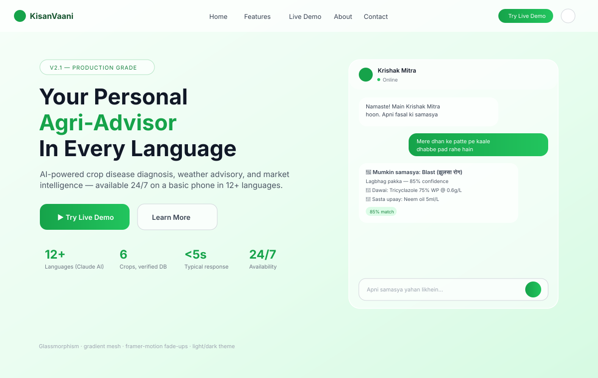
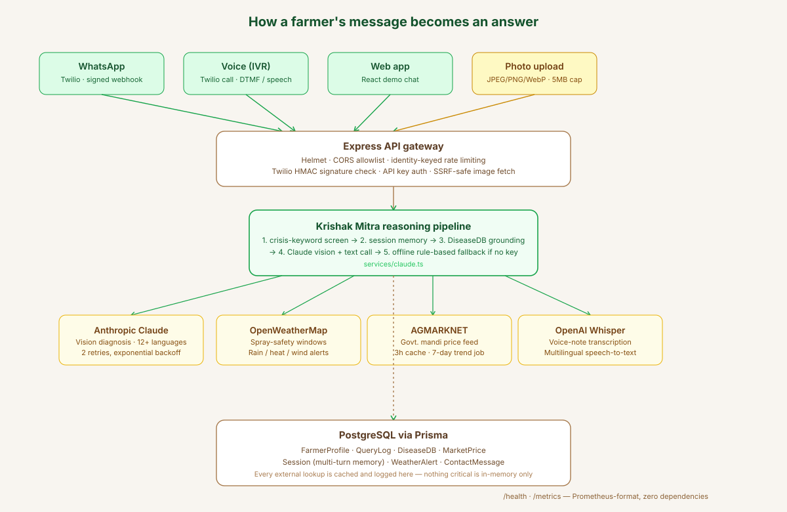

<div align="center">

### An AI agronomist that picks up the phone, reads a photo of a sick leaf, and answers back in the farmer's own language — on WhatsApp, on a voice call, or on the web.
 
[](#)
[](#)
[](#)
[](#)
[](#)
[](#)
 
</div>
---
 
## What this actually is
 
A smallholder farmer in rural India does not own a laptop. Most don't own a smartphone either. What they do have is a basic phone that can take a call, send a WhatsApp voice note, or snap one blurry photo of a leaf covered in black spots. **KisanVaani is built around that constraint, not despite it.**
 
You can ask it three things, and it will give you a straight answer instead of a guess dressed up as one:
 
- **"What's wrong with my crop?"** — describe it, say it out loud, or send a photo. It cross-references your symptoms against a verified, seeded disease database before it ever lets an LLM free-associate a diagnosis.
- **"Can I spray today?"** — it pulls a live OpenWeatherMap forecast and runs your actual wind speed, humidity, and temperature through a real spray-safety rule set. No "probably fine," just numbers and a yes or no.
- **"What's my crop worth right now?"** — government AGMARKNET mandi prices, cached, with a genuine 7-day trend computed from real historical rows — not a coin flip dressed up as an "up/down" arrow.
And if a conversation turns into something heavier than crop disease — debt, despair, the kind of phrasing that shows up before a tragedy — the system recognizes it in multiple languages and immediately surfaces the Tele MANAS and KIRAN national helplines instead of trying to be clever about pesticides. That's not a footnote feature. It's baked into the response pipeline before anything else runs.
 
---
 
## See it in action
 
<div align="center">

</div>
The actual interface: a glass-morphism hero in primary green (`#16a34a`) and warm gold (`#eab308`), Playfair Display for headlines, Inter for body copy, JetBrains Mono for the technical accents — built with Tailwind's extended theme, `framer-motion` fade-ups on scroll, a 3D particle field via `@react-three/fiber`, and full light/dark theming through CSS custom properties so the glass blur and shadows actually adapt instead of just inverting black to white.
 
What you're looking at on the right isn't a screenshot mockup of imaginary functionality — every element traces to a real component: `DemoChat.tsx` for the conversation thread, the confidence-percentage pill color-coded by `msg.confidence` (green above 80%, amber above 50%, red below), and the degraded-mode banner that explicitly tells the farmer when they're talking to the offline rule-based fallback instead of live Claude — because pretending an offline demo is a real diagnosis is exactly the kind of dishonesty this codebase was deliberately built to avoid.
 
---
 
## How a message actually moves through the system
 
<div align="center">

</div>
Three channels — the web widget, a signed Twilio WhatsApp webhook, and a Twilio voice IVR tree with Hindi/Telugu/Kannada language selection — all funnel into one Express gateway. That gateway isn't decorative middleware; it's `helmet`, a CORS allowlist that refuses to boot in production if left wide open, identity-keyed rate limiting (because rural India runs on carrier-grade NAT, so punishing by raw IP punishes entire villages for one heavy user), and `zod` schema validation on every payload.
 
Past the gateway, every message hits a crisis keyword pre-filter in Hindi, English, and Swahili before it touches anything agricultural. Only then does it reach `generateResponse()` — which loads session history from Postgres for multi-turn memory, runs a lightweight symptom-matching pass against the seeded `DiseaseDB` table, and builds that into a grounding block injected straight into Claude's system prompt. If the farmer attached a photo, it's fetched through an SSRF-hardened fetcher (blocked private IP ranges, an explicit host allowlist, redirect rejection) and sent as a real vision content block — not a placeholder string pretending to be image understanding, which is what an earlier version of this code actually did before it got ripped out.
 
If the Claude API key is missing, expired, or the call fails twice with backoff, the system doesn't throw a 500 at a farmer mid-emergency. It drops to a rule-based path that still queries the real disease database, still pulls live weather, still pulls live market data — it just can't reason about a novel combination of symptoms the way the full model can. And it says so, explicitly, in the response (`degraded: true`), instead of quietly serving a worse answer with the same confidence.
 
---
 
## The stack, with receipts
 
<table>
<tr><td width="50%" valign="top">
### Backend — `Express` + `TypeScript`
- **Prisma ORM → PostgreSQL** — seven real tables: `FarmerProfile`, `QueryLog`, `DiseaseDB`, `WeatherAlert`, `MarketPrice`, `Session`, `ContactMessage`
- **Claude API** — text + vision, multi-turn, retried with exponential backoff
- **OpenAI Whisper** — voice note transcription for WhatsApp audio
- **Twilio** — WhatsApp webhook + voice IVR, both signature-validated in *every* environment, not just production
- **OpenWeatherMap** — live forecast → translated condition strings → rule-based spray advisory
- **AGMARKNET (data.gov.in)** — government mandi price API with a 3-hour Postgres cache and a background refresh job that actually accumulates 7-day history
- **Resend** — contact form email notifications, with the message persisted to the DB first regardless of whether email delivery succeeds
- **Zero-dependency structured logger and Prometheus-format `/metrics`** — no `winston`, no `prom-client`, hand-rolled because the surface area didn't justify the dependency
</td><td width="50%" valign="top">
### Frontend — `React 18` + `Vite` + `TypeScript`
- **Tailwind**, extended with a custom `primary` (green), `accent` (gold), and `earth` color ramp, `Playfair Display` / `Inter` / `JetBrains Mono` type system
- **`framer-motion`** for every scroll-triggered reveal
- **`@react-three/fiber` + `three`** for the hero's particle field
- **Web Speech API** for in-browser voice input on the demo chat
- **`react-router-dom`** across five routes: Home, Demo, Features, About, Contact
- **`vitest` + Testing Library** — components and hooks have real test files, not an empty `__tests__` folder for show
</td></tr>
</table>
---
 
## What's real vs. what's clearly labeled as a stand-in
 
This matters, because a portfolio project that quietly fakes its own demo is worse than one that's honest about its limits.
 
| Capability | Status |
|---|---|
| Crop disease matching | Real — scored against a seeded, multi-field Postgres table with organic/chemical treatments, prevention, season windows, and regional relevance |
| Vision-based diagnosis from photos | Real — actual Claude vision API call, not a placeholder description string |
| Weather + spray safety | Real — live OpenWeatherMap call, rule-based thresholds on wind/humidity/temperature |
| Market prices | Real — live AGMARKNET government API with Postgres caching; falls back to a small, explicitly-commented "illustrative, not live" static table only when the API key is absent |
| Multi-turn memory | Real — Postgres-backed session context, capped and trimmed per conversation |
| Crisis detection | Real — keyword pre-filter plus instructed model behavior, with verified, currently-active Indian helpline numbers (no invented numbers for regions where none were verified) |
| Banned pesticide filtering | Enforced via system prompt instruction — Monocrotophos, Methyl Parathion, Phorate, Endosulfan explicitly excluded |
| Offline fallback mode | Real and disclosed — clearly flagged as `degraded` to both the API consumer and the chat UI, never silently substituted |
 
---
 
## Getting it running
 
```bash
git clone https://github.com/sat1828/KisanVaani.git
cd KisanVaani
npm run setup          # installs root + backend + frontend, generates Prisma client
 
cp backend/.env.example backend/.env
# fill in DATABASE_URL, ANTHROPIC_API_KEY, OPENWEATHER_API_KEY, etc.
# the app runs without every key — it just degrades the relevant feature honestly
 
npm run db:migrate
npm run db:seed        # loads the verified disease database
npm run dev             # backend on :3001, frontend on :5173, concurrently
```
 
Docker, if you'd rather not run Postgres locally:
 
```bash
cp backend/.env.example backend/.env
echo "DB_PASSWORD=$(openssl rand -hex 16)" >> backend/.env
docker compose up --build
```
 
The compose file refuses to start without a real `DB_PASSWORD` — there used to be a hardcoded fallback baked into source control, and that's exactly the kind of thing that gets fixed, not shipped.
 
---
 
## Project shape
 
```
KisanVaani/
├── backend/
│   ├── src/
│   │   ├── api/            # chat, weather, market, webhook, upload, contact
│   │   ├── services/       # claude.ts (the brain), whisper.ts (voice)
│   │   ├── middleware/     # auth.ts (API key + Twilio signatures), errorHandler.ts
│   │   ├── lib/             # safeFetch.ts (SSRF guard), logger.ts, metrics.ts
│   │   └── __tests__/       # auth, crisis, market, metrics, safeFetch
│   └── prisma/
│       ├── schema.prisma    # 7 models, fully indexed
│       └── seed.ts          # 10 verified disease/pest entries across 6 crops (rice, wheat, cotton, maize, tomato, banana) — each with local name, scientific name, organic + chemical treatment, prevention, and season window
└── frontend/
    └── src/
        ├── pages/            # Home, Demo, Features, About, Contact, NotFound
        ├── components/       # Hero, DemoChat, WeatherWidget, MarketPrices, …
        └── hooks/            # useTheme, useScrollAnimation
```
 
---
 
## On the engineering decisions that aren't visible on the surface
 
A few things in this codebase exist specifically because the first version of them was wrong, and got corrected — which is a more honest signal than a project that's never had anything to fix:
 
- Twilio webhook signature validation now runs in **every** environment, not just production — an unsigned webhook is a live cost-abuse vector in staging too, since it can trigger real outbound messages and paid AI calls.
- Market price trend used to be computed from a single snapshot's bid-ask spread, which meant it could mathematically never report a price drop. It's now computed against real 7-day historical averages, with an honest "unknown" state when there isn't enough history yet — not a fabricated guess.
- Rate limiting is keyed by identity (API key or phone number), not raw IP, because rural India's carrier-grade NAT means one heavy user behind a shared IP would otherwise throttle an entire village.
- The contact form used to fake a "Message Sent!" state with a `setTimeout` and send nothing anywhere. It now persists to Postgres first as the actual source of truth, and only reports success based on that — email notification is a secondary, best-effort layer on top.
---
 
<div align="center">
Built by **[Satyajit Parida](https://github.com/sat1828)** — AI/ML engineer, full-stack developer.
 
If you're evaluating this for technical depth rather than UI polish, start at `backend/src/services/claude.ts` — that's where the actual decision-making lives.
 
</div>
